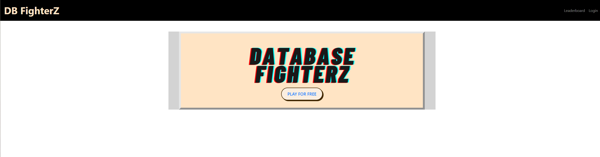
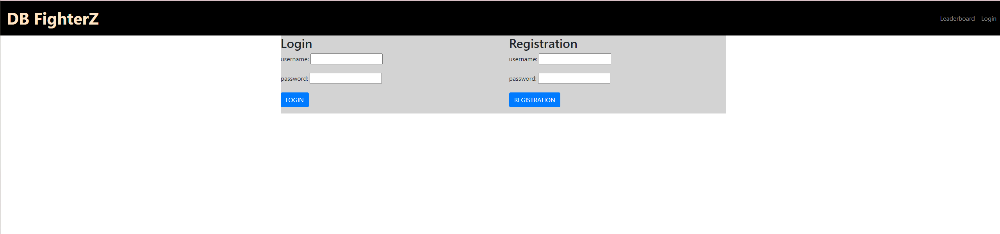
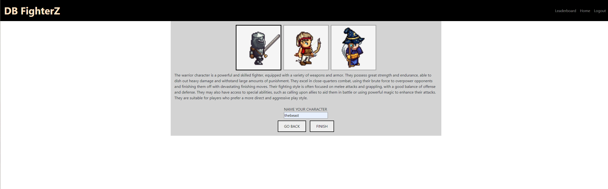
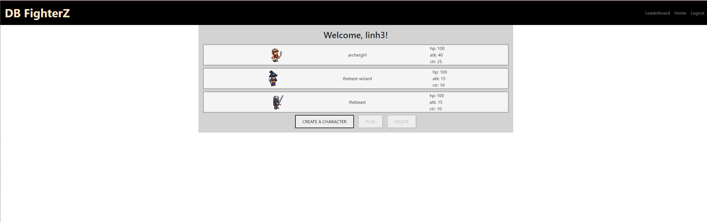
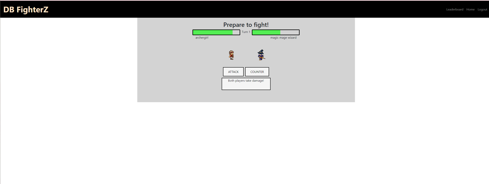
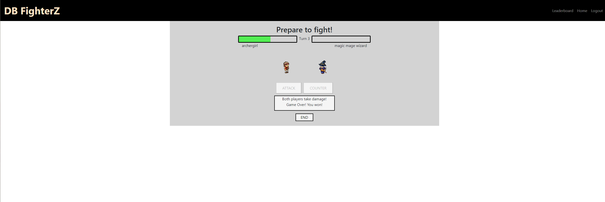
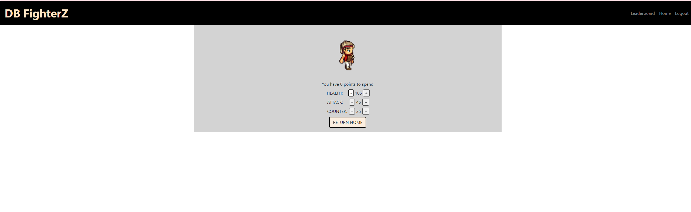

# DB FighterZ

## Description

Introducing an epic browser-based fighting game that immerses players in a fantasy world where they can choose to be a powerful Warrior, a skilled Archer, or a masterful Mage. Each class has its own unique characteristics, strengths, and weaknesses, allowing players to customize their gameplay experience and compete against other characters in real-time battles. With stunning graphics, smooth animations, and challenging AI opponents, this game will keep players coming back for more action-packed adventure.

## Table of Contents

- [Description](#description)
- [Installation](#installation)
- [Usage](#usage)
- [Questions](#question)
- [Credits](#credit)
- [Contributions](#contribution)

## Installation

This project uses the node modules:

    bcrypt: 5.1.0

    connect-session-sequelize: 7.1.5

    dotenv: 16.0.3

    express: 4.18.2

    express-handlebars: 6.0.6

    express-session: 1.17.3

    mysql2: 2.3.3

    sequelize: 6.28.0

Steps to start the application locally:

1.  Run the SQL commands to create the database in mySQL workbench

2.  Run

         npm i

    then

        npm run seed

    then

        npm start
3. Open localhost:3001 in your web browser.

## Usage

Play with us @ https://dbfighterz.herokuapp.com/

DB FighterZ - homepage.

DB FighterZ - login and Registration page

DB FighterZ - your Character List and Create A Character page

DB FighterZ - Game start

DB FighterZ - Game End

DB FighterZ - Upgrade Points for your Character

## Question

If you have any questions about the repo, open and issue or contact us directly at linhklatt@yahoo.com, eduardogoto8@gmail.com, ryanfernandez11@gmail.com

## Credit

Ana T. of animista.net for CSS animations

Database FighterZ Logo made using canva.com

Game modeled after Liam Maclachlan’s “Turn Based Fighter”

    codepen.io/Limey_88/pen/gbypXg

Character sprites with Universal LPC Spritesheet Generator

- sanderfrenken.github.io/Universal-LPC-Spritesheet-Character-Generator/
- Sprites by: drjamgo@hotmail.com, bluecarrot16, Benjamin K. Smith (BenCreating), Evert, Eliza Wyatt (ElizaWy), TheraHedwig, MuffinElZangano, Durrani, Johannes Sjolund (wulax), Stephen Challener (Redshrike), Michael Whitlock (bigbeargames), Matthew Krohn (makrohn), Nila122, Pierre Vigier (pvigier), Manuel Riecke (MrBeast), David Conway Jr. (JaidynReiman), Marcel van de Steeg (MadMarcel), Mandi Paugh, William.Thompsonj, Joe White, Daniel Eddeland (daneeklu), gr3yh47, Tracy, Thane Brimhall (pennomi), laetissima
- Sprites contributed as part of the Liberated Pixel Cup project from OpenGameArt.org: http://opengameart.org/content/lpc-collection License: Creative Commons Attribution-ShareAlike 3.0 (CC-BY-SA 3.0) http://creativecommons.org/licenses/by-sa/3.0/

## Contribution

A game developed by Ryan Fernandez, Linh Klatt, and Eddy Goto
